# Manual de instalación para Plugin Woocommerce

## Descripción

Este plugin oficial ha sido creado para que puedas integrar Webpay fácilmente en tu comercio, basado en Woocommerce.

## Requisitos

Debes tener instalado previamente Woocommerce.

Habilitar los siguientes módulos / extensiones para PHP:
- OpenSSL 1.0.1 o superior
- SimpleXML
- DOM 2.7.8 o superior

## Instalación de Plugin

1. Dirígete a [https://github.com/TransbankDevelopers/transbank-plugin-woocommerce-webpay-rest/releases/latest](https://github.com/TransbankDevelopers/transbank-plugin-woocommerce-webpay-rest/releases/latest), y descargue la última versión disponible del plugin.

  Una vez descargado el plugin, ingresa a la página de administración de Woocommerce (usualmente en http://misitio.com/wp-admin, http://localhost/wp-admin) y dirígete a (Plugins / Add New), indicado a continuación:

  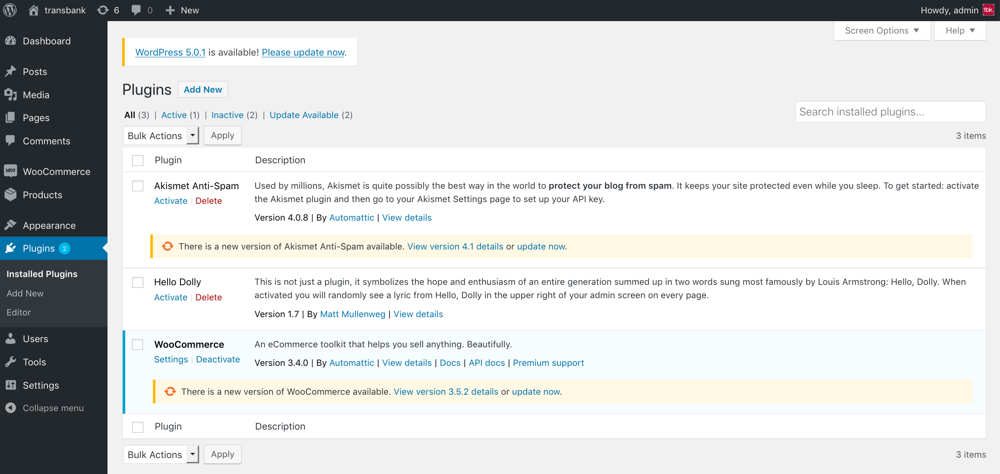
  
2. Selecciona el archivo que descargaste en el paso anterior. Al finalizar aparecerá que fue instalado exitosamente.

  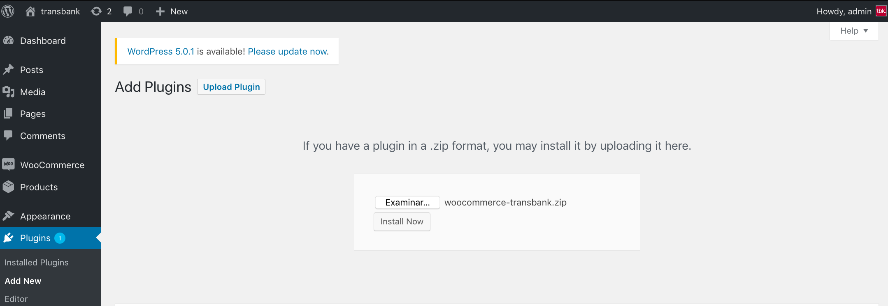

3. Además debes `Activar Plugin`.

  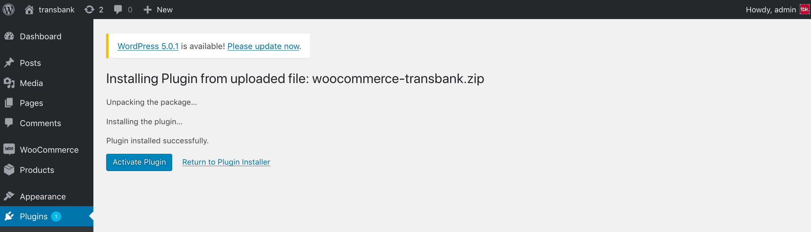

## Configuración

Este plugin posee un sitio de configuración que te permitirá ingresar credenciales que Transbank te otorgará y además podrás generar un documento de diagnóstico en caso que Transbank te lo pida.

**IMPORTANTE:** El plugin solamente funciona con moneda chilena (CLP). Dado esto Woocommerce debe estar configurado con moneda Peso Chileno y país Chile para que se pueda usar Webpay.

Para acceder a la configuración, debes seguir los siguientes pasos:

1. Dirígete a la página de administración de Woocommerce (usualmente en http://misitio.com/wp-admin, http://localhost/wp-admin) e ingresa usuario y clave.

2. Dentro del sitio de administración dirígete a (Plugins / Installed Plugins) y busca `Transbank Webpay Plus`.

  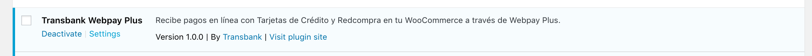

3. Presiona el link `Settings` del plugin y te llevará a la pagina de configuración del plugin.

  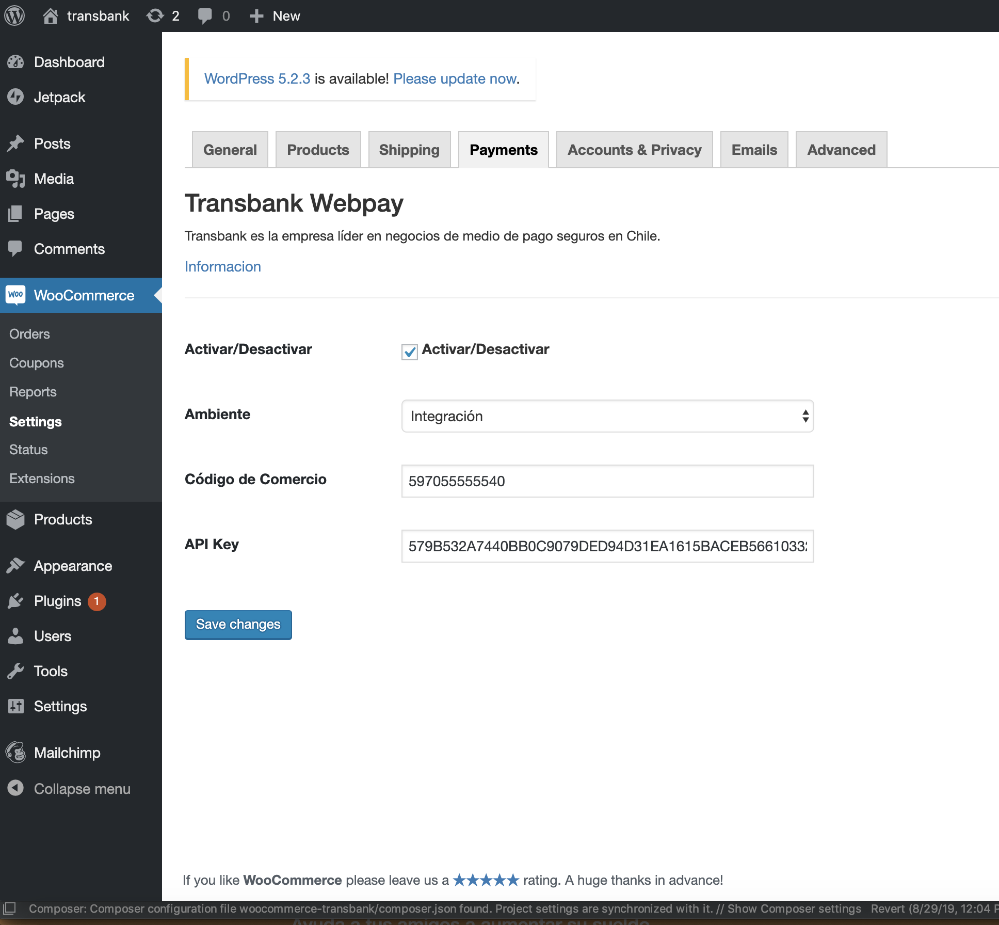

4. ¡Ya está! Estás en la pantalla de configuración del plugin, debes ingresar la siguiente información:

  * **Ambiente**: Ambiente hacia donde se realiza la transacción. 
  * **Código de comercio**: Es lo que te identifica como comercio.
  * **API Key**: API Key es la clave para acceder a los servicios rest de webpay.
  

  Las opciones disponibles para _Ambiente_ son: "Integración" para realizar pruebas y certificar la instalación con Transbank, y "Producción" para hacer transacciones reales una vez que Transbank ha aprobado el comercio.
  
### Credenciales de Prueba

Para el ambiente de Integración, puedes utilizar las siguientes credenciales para realizar pruebas:

* Código de comercio: `597020000540`
* API Key : `579B532A7440BB0C9079DED94D31EA1615BACEB56610332264630D42D0A36B1C`

1. Guardar los cambios presionando el botón [Save changes]

2. Además, puedes generar un documento de diagnóstico en caso que Transbank te lo pida. Para ello, haz click en el botón "Información" ahí podrás descargar un pdf.

  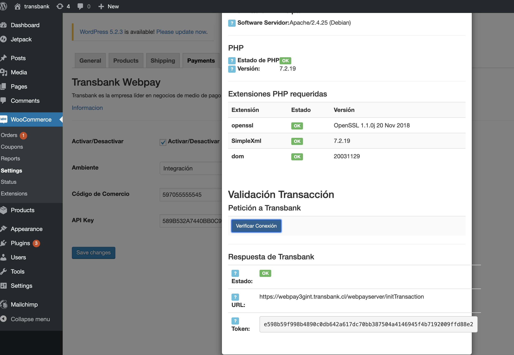

## Prueba de instalación con transacción

En ambiente de integración es posible realizar una prueba de transacción utilizando un emulador de pagos online.

* Ingresa al comercio

  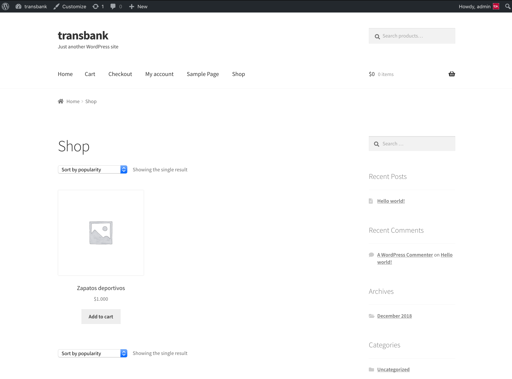

* Ingresa a cualquier sección para agregar productos

  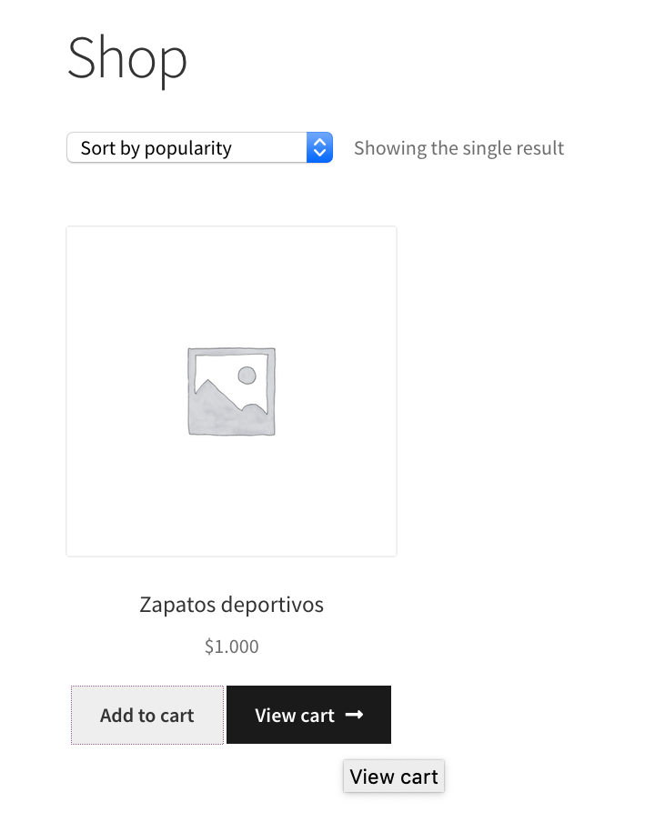

* Agrega al carro de compras un producto, selecciona el carro de compras y luego presiona el botón [Proceed to checkout]:

  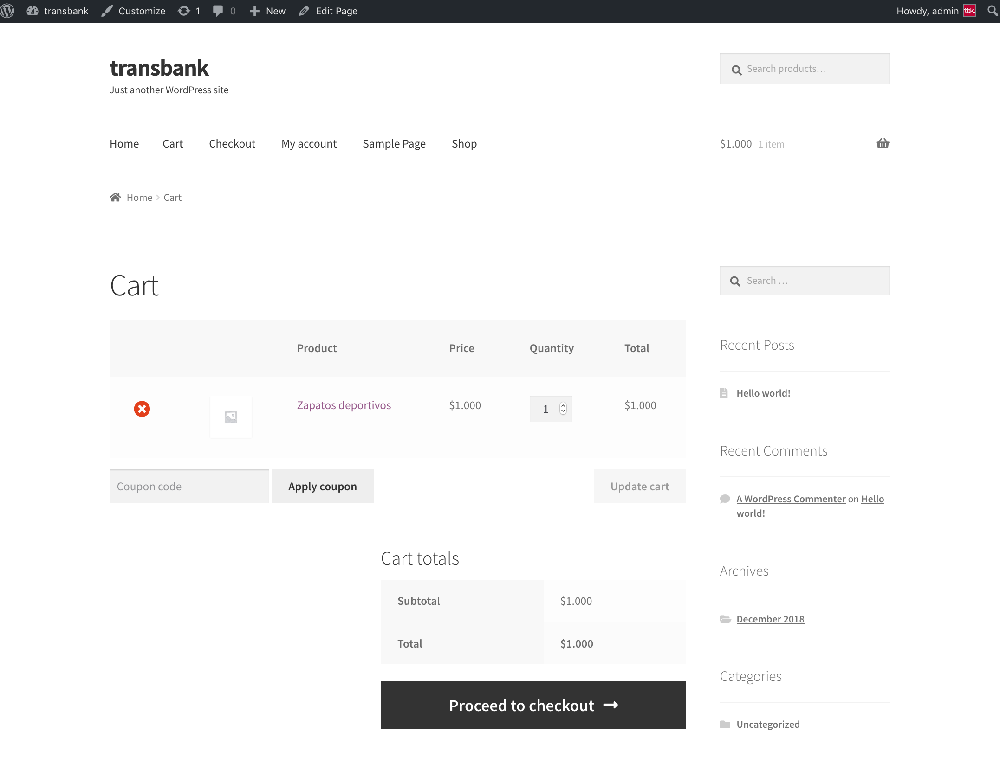

* Agrega los datos que te pida y selecciona `Transbank Webpay` luego presiona el botón [Place order]

  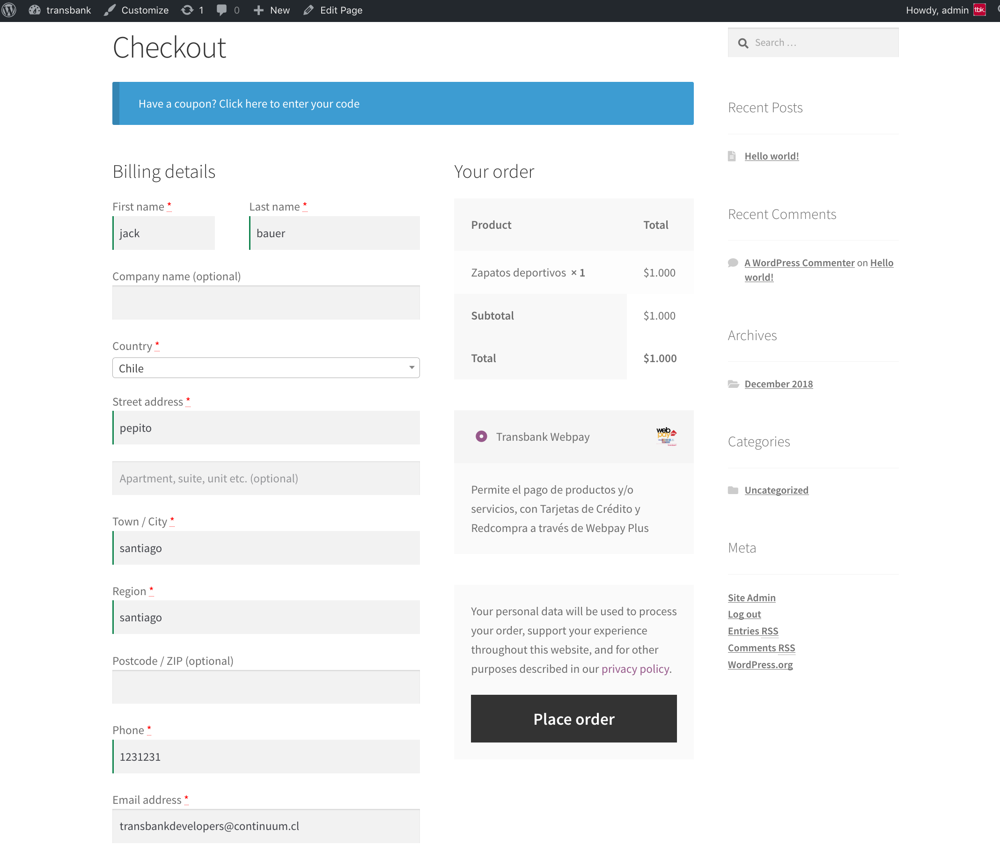

* Una vez presionado el botón para iniciar la compra, se mostrará la ventana de pago Webpay y deberás seguir el proceso de pago.

Para pruebas puedes usar los siguientes datos:  

* Número de tarjeta: `4051885600446623`
* Rut: `11.111.111-1`
* Cvv: `123`

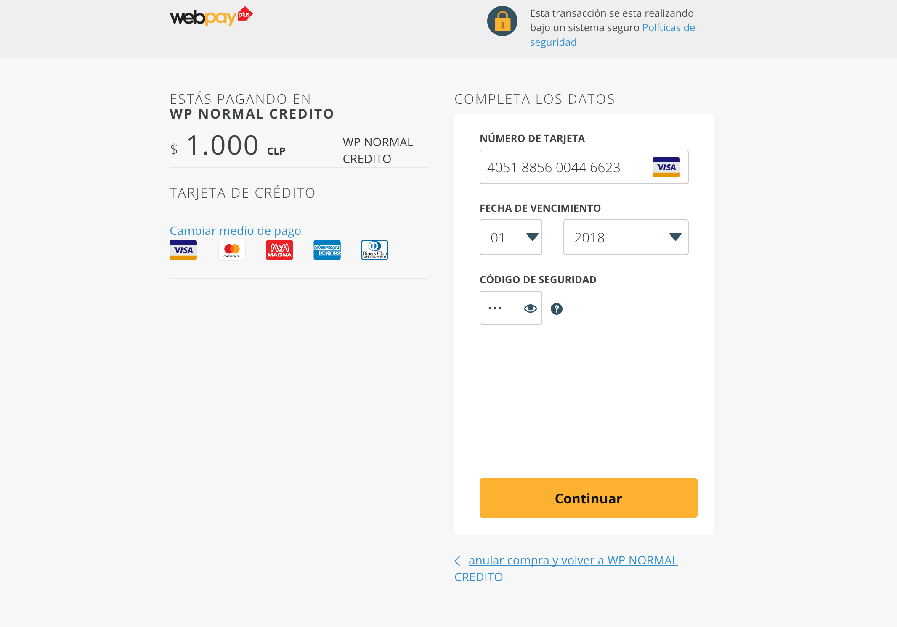

Para pruebas puedes usar los siguientes datos:  

* Rut: `11.111.111-1`
* Clave: `123`

Puedes aceptar o rechazar la transacción

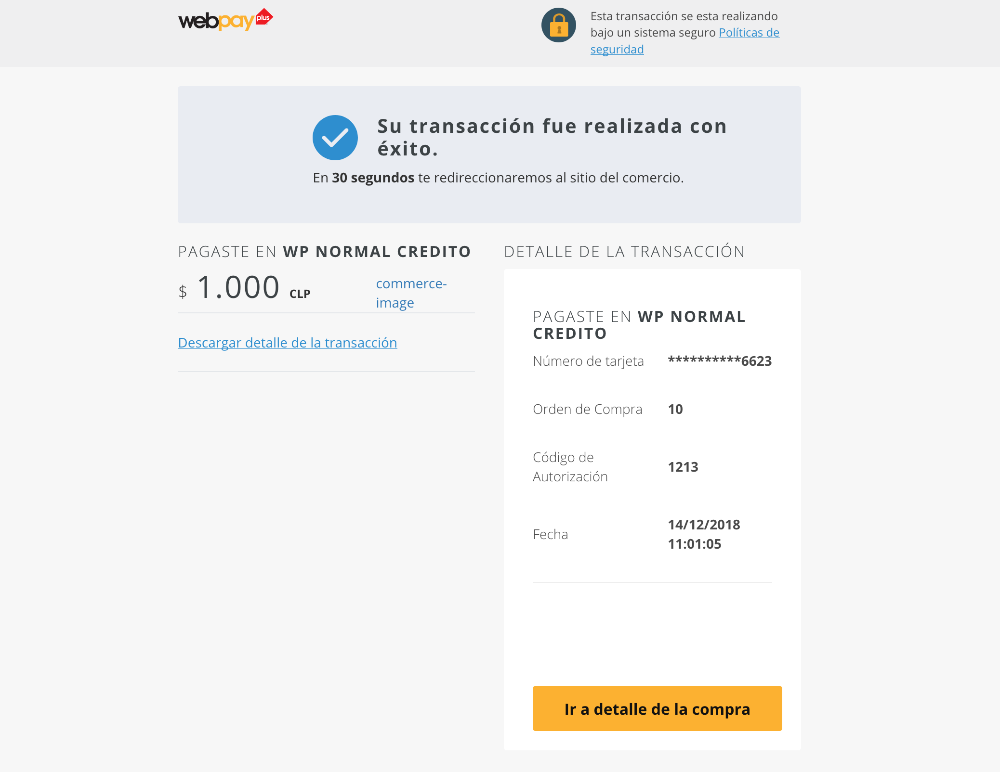

* Serás redirigido a Woocommerce y podrás comprobar que el pago ha sido exitoso.

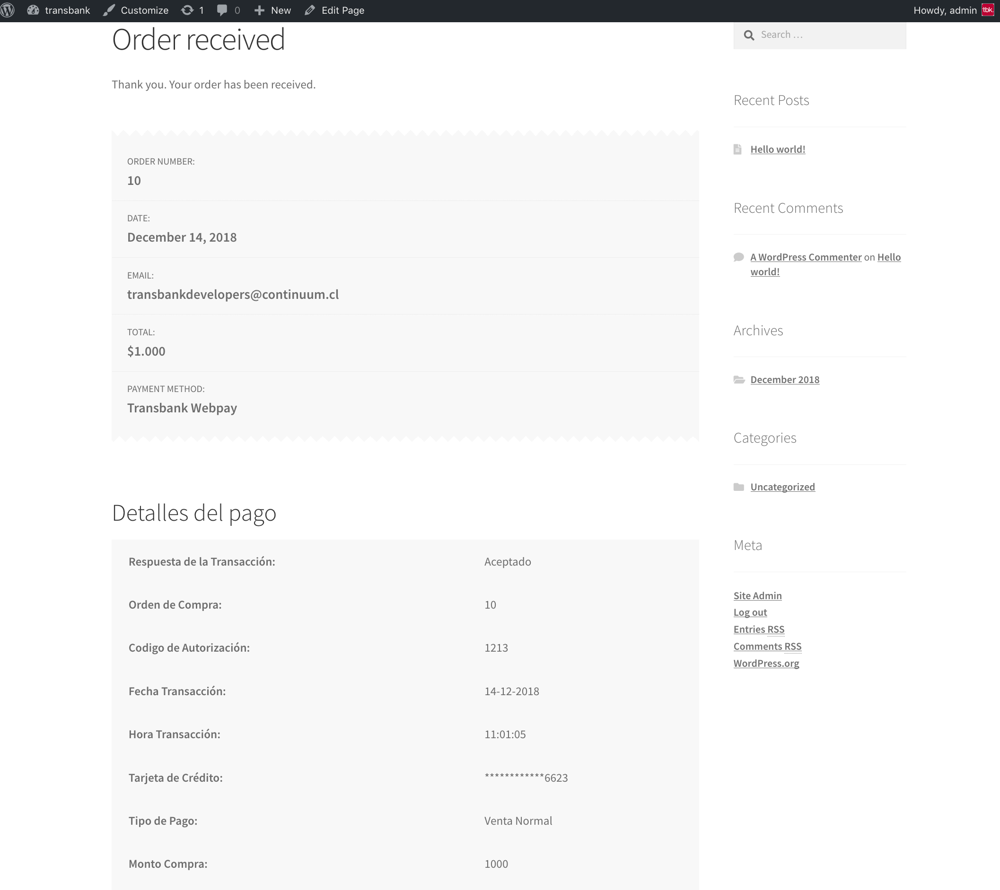

* Además si accedes al sitio de administración sección (Woocommerce / Orders) se podrá ver la orden creada y el detalle de los datos entregados por Webpay.

 

 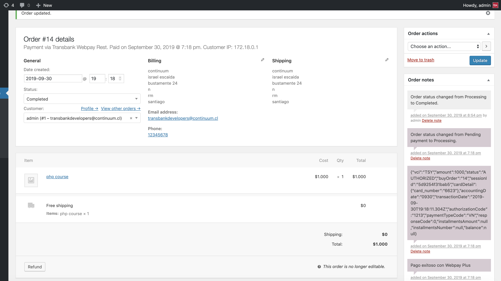
