# Manual de instalación para plugin WooCommerce

## Descripción

Este plugin oficial ha sido creado para que puedas integrar Webpay fácilmente en tu comercio, basado en WooCommerce.

## Requisitos

Debes tener instalado previamente WooCommerce.

Debes habilitar los siguientes módulos/extensiones para PHP:

- OpenSSL 1.0.1 o superior
- SimpleXML
- DOM 2.7.8 o superior

## Instalación del plugin

1. Dirígete a [https://github.com/TransbankDevelopers/transbank-plugin-woocommerce-webpay-rest/releases/latest](https://github.com/TransbankDevelopers/transbank-plugin-woocommerce-webpay-rest/releases/latest) y descarga la última versión disponible del plugin.

Una vez descargado el plugin, ingresa a la página de administración de WooCommerce (usualmente en `http://misitio.com/wp-admin` o `http://localhost/wp-admin`) y dirígete a `Plugins / Add New`, como se muestra a continuación:

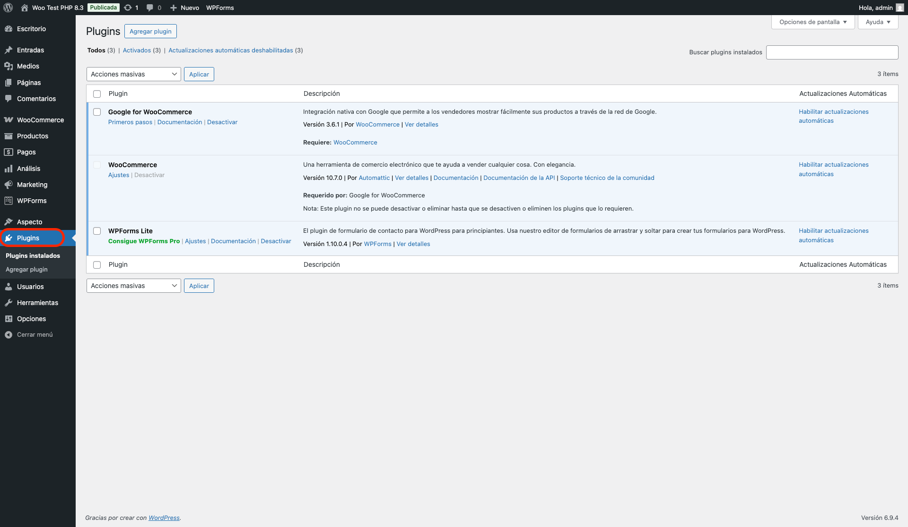

2. Selecciona el archivo que descargaste en el paso anterior. Al finalizar aparecerá que fue instalado exitosamente.

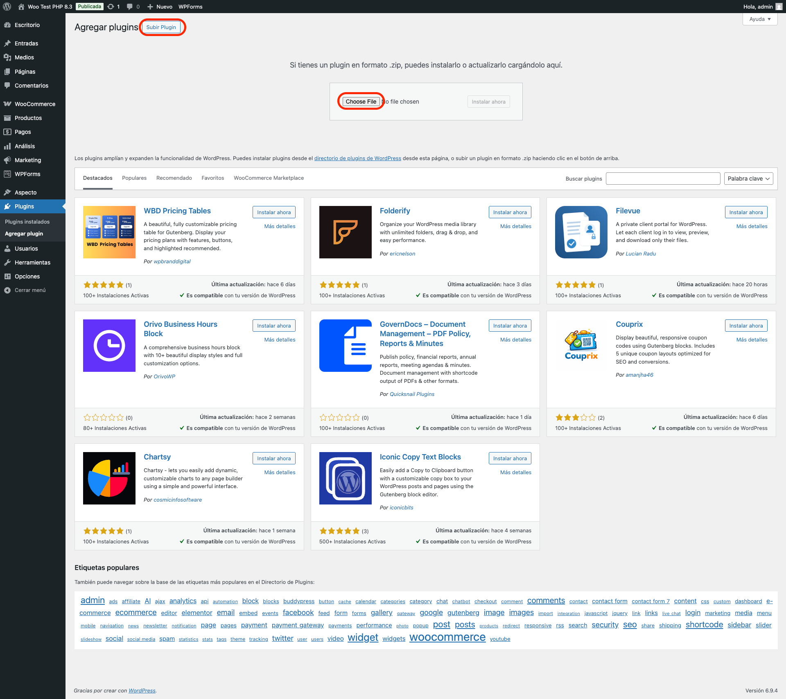

3. Además, debes `Activar Plugin`.

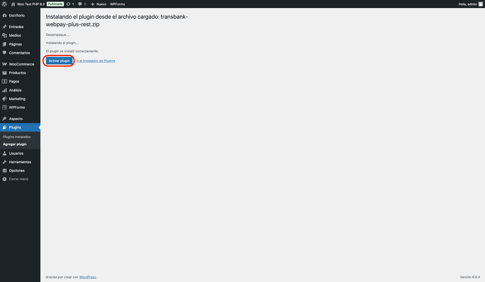

## Configuración

Este plugin posee una pantalla de configuración que te permitirá ingresar las credenciales que Transbank te otorgará. Además, podrás generar un documento de diagnóstico en caso de que Transbank te lo solicite.

**IMPORTANTE:** El plugin solamente funciona con moneda chilena (CLP). Por ello, WooCommerce debe estar configurado con moneda Peso chileno y país Chile para que se pueda usar Webpay.

Para acceder a la configuración, debes seguir los siguientes pasos:

1. Dirígete a la página de administración de WooCommerce (usualmente en `http://misitio.com/wp-admin` o `http://localhost/wp-admin`) e ingresa usuario y clave.

2. Dentro del sitio de administración, dirígete a `Plugins / Installed Plugins` y busca `Transbank Webpay Plus`.

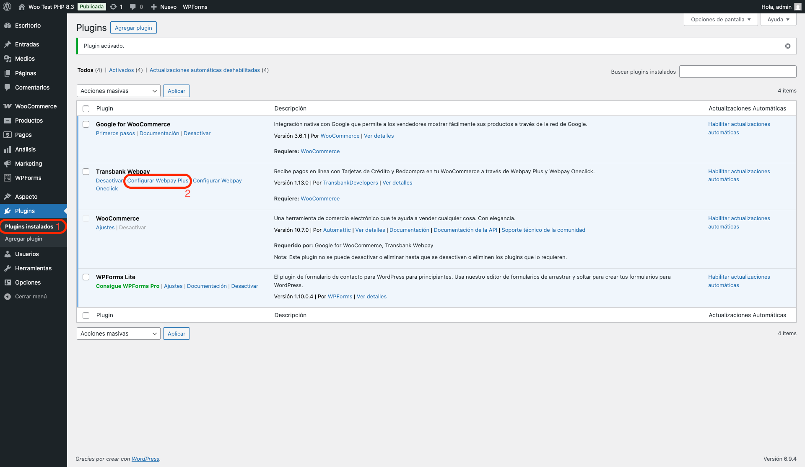

3. Presiona el enlace `Configurar Webpay Plus` o `Configurar Webpay Oneclick` del plugin. Esto te llevará a la página de configuración del respectivo producto.

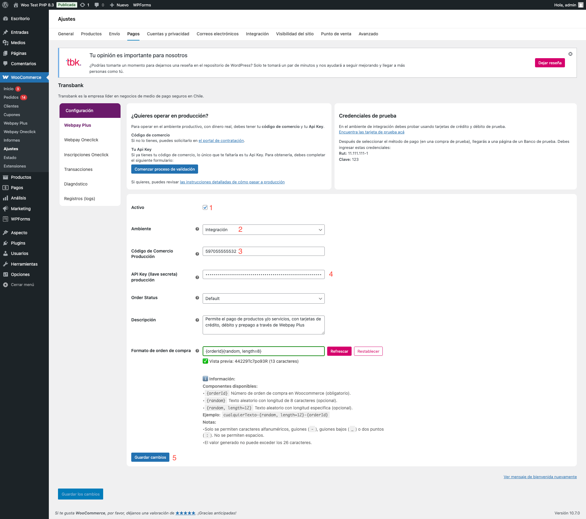

4. Ya estás en la pantalla de configuración del plugin. Debes ingresar la siguiente información:

- **Ambiente**: Ambiente en el que se realiza la transacción.
- **Código de comercio**: Es lo que te identifica como comercio.
- **API Key**: Es la clave para acceder a los servicios REST de Webpay.

Las opciones disponibles para _Ambiente_ son: "Integración" para realizar pruebas y certificar la instalación con Transbank, y "Producción" para hacer transacciones reales una vez que Transbank ha aprobado el comercio.

### Credenciales de Prueba

Para el ambiente de Integración, puedes utilizar las siguientes credenciales de prueba:

- Código de comercio: `597055555540`
- API Key: `579B532A7440BB0C9079DED94D31EA1615BACEB56610332264630D42D0A36B1C`

1. Guarda los cambios presionando el botón [Save changes].

2. Además, puedes verificar la conexión con Transbank desde la sección `Diagnóstico`. Para ello, haz clic en `Diagnóstico` y luego en el botón `Verificar conexión` del producto que desees verificar.

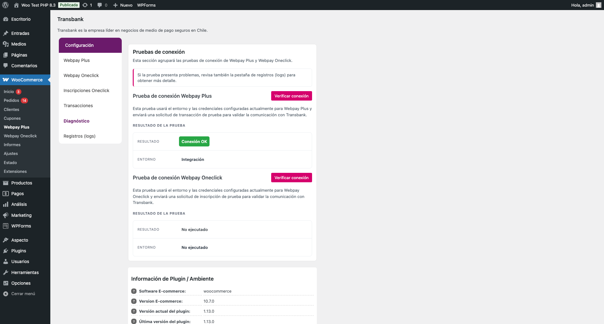

## Prueba de instalación con transacción

Es posible hacer una transacción de prueba utilizando el ambiente de integración.

- Ingresa al comercio

    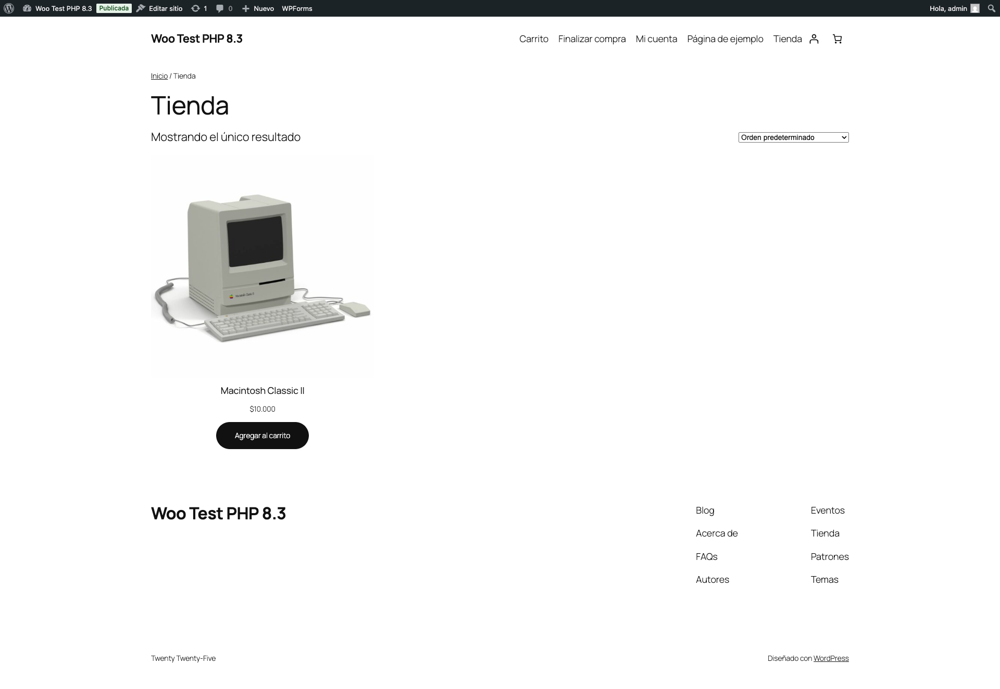

- Ingresa a la tienda para poder agregar productos

    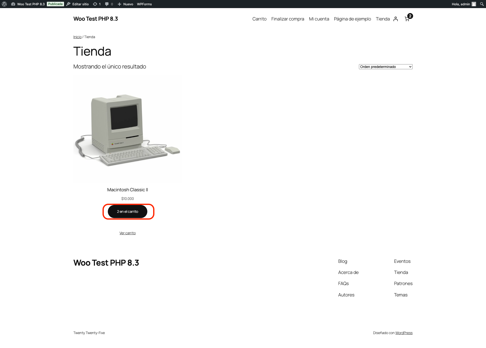

- Agrega un producto al carro de compras, selecciona el carro y luego presiona el botón [Finalizar compra]:

    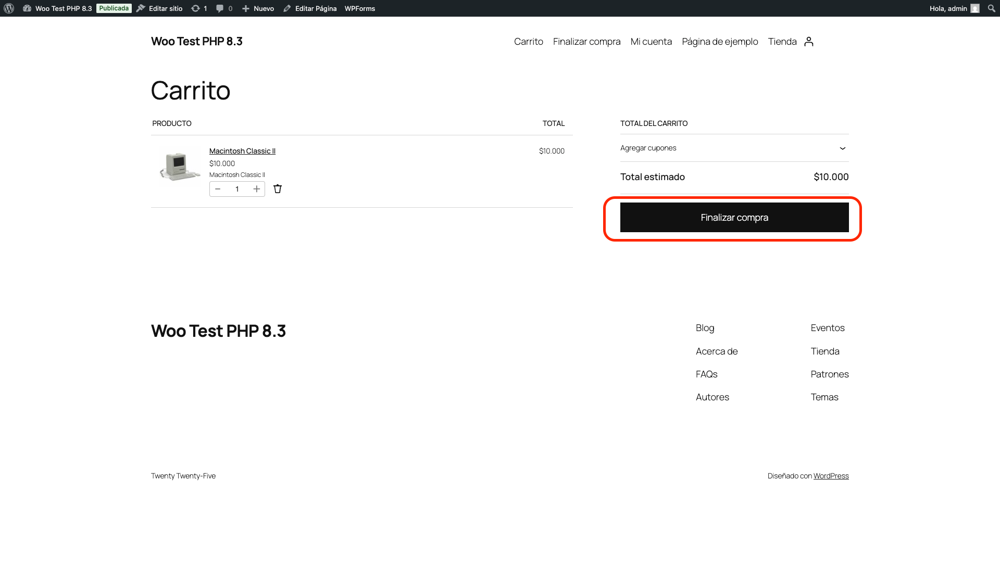

- Ingresa los datos solicitados en el formulario y luego selecciona un medio de pago como `Webpay Plus`; finalmente, presiona el botón [Realizar el pedido]:

    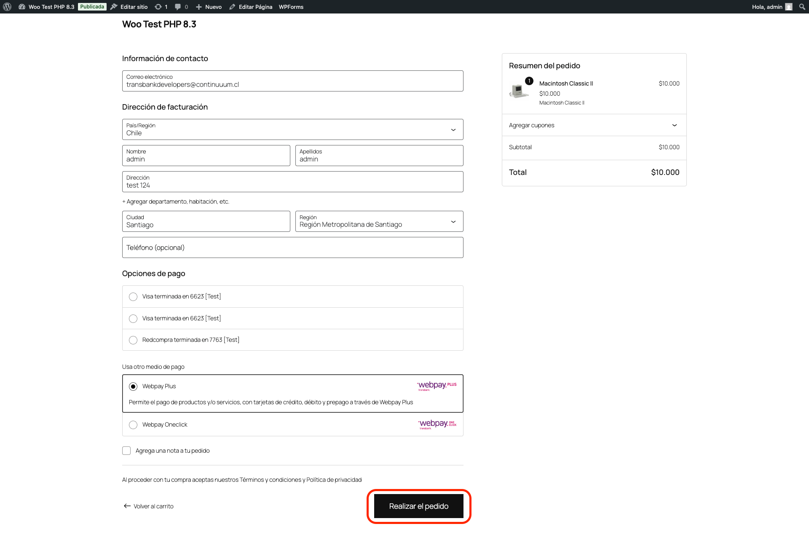

- Una vez presionado el botón para iniciar la compra, se mostrará la ventana de pago Webpay y deberás seguir el proceso de pago.

Para realizar pruebas, puedes usar los siguientes datos:

- Número de tarjeta: `4051885600446623`
- RUT: `11.111.111-1`
- CVV: `123`
- Fecha de expiración: `cualquiera`

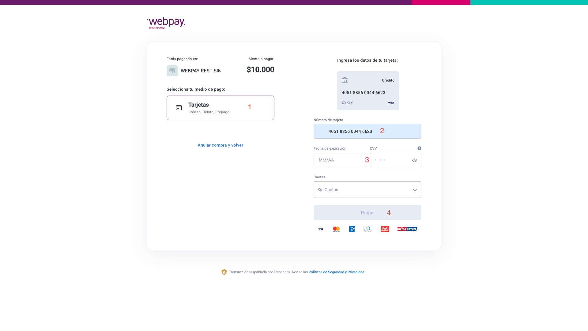

Luego se te mostrará la pantalla que simula el portal bancario; ahí puedes usar los siguientes datos:

- RUT: `11.111.111-1`
- Clave: `123`

Puedes aceptar o rechazar la transacción.

- Serás redirigido a WooCommerce y podrás comprobar que el pago ha sido exitoso.

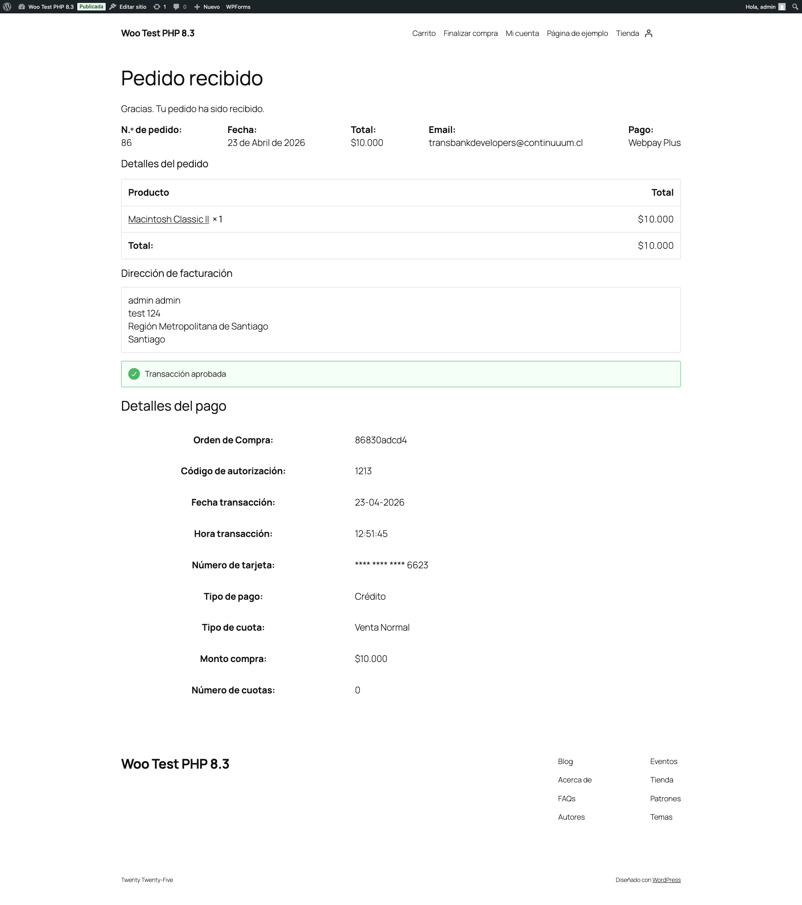

- Además, si accedes a la sección `WooCommerce / Orders` del sitio de administración, podrás ver la orden creada y el detalle de los datos entregados por Webpay.

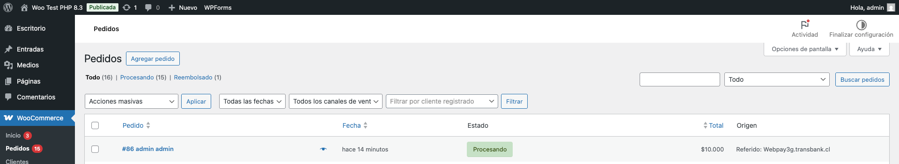

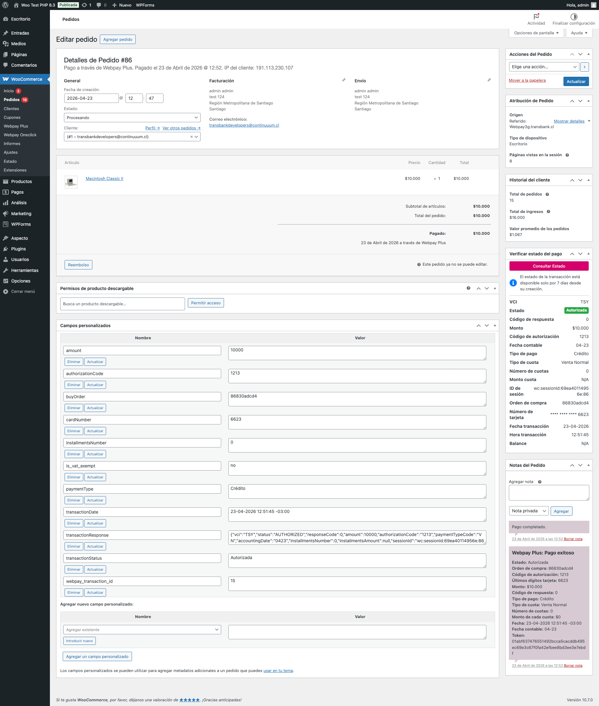

## Pasar a producción

Para operar en el ambiente de producción (con dinero real), debes pasar por un proceso de validación. Puedes ver las instrucciones [acá](https://transbankdevelopers.cl/plugin/woocommerce/#puesta-en-produccion).
